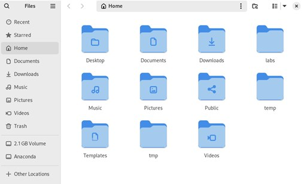

---
## Front matter
title: "Отчет по лабораторной работе №2"
subtitle: "Дисциплина: архитектура компьютера"
author: "Cокирка Анна Константиновна"

## Generic otions
lang: ru-RU
toc-title: "Содержание"

## Bibliography
bibliography: bib/cite.bib
csl: pandoc/csl/gost-r-7-0-5-2008-numeric.csl

## Pdf output format
toc: true # Table of contents
toc-depth: 2
lof: true # List of figures
lot: true # List of tables
fontsize: 12pt
linestretch: 1.5
papersize: a4
documentclass: scrreprt
## I18n polyglossia
polyglossia-lang:
  name: russian
  options:
	- spelling=modern
	- babelshorthands=true
polyglossia-otherlangs:
  name: english
## I18n babel
babel-lang: russian
babel-otherlangs: english
## Fonts
mainfont: IBM Plex Serif
romanfont: IBM Plex Serif
sansfont: IBM Plex Sans
monofont: IBM Plex Mono
mathfont: STIX Two Math
mainfontoptions: Ligatures=Common,Ligatures=TeX,Scale=0.94
romanfontoptions: Ligatures=Common,Ligatures=TeX,Scale=0.94
sansfontoptions: Ligatures=Common,Ligatures=TeX,Scale=MatchLowercase,Scale=0.94
monofontoptions: Scale=MatchLowercase,Scale=0.94,FakeStretch=0.9
mathfontoptions:
## Biblatex
biblatex: true
biblio-style: "gost-numeric"
biblatexoptions:
  - parentracker=true
  - backend=biber
  - hyperref=auto
  - language=auto
  - autolang=other*
  - citestyle=gost-numeric
## Pandoc-crossref LaTeX customization
figureTitle: "Рис."
tableTitle: "Таблица"
listingTitle: "Листинг"
lofTitle: "Список иллюстраций"
lotTitle: "Список таблиц"
lolTitle: "Листинги"
## Misc options
indent: true
header-includes:
  - \usepackage{indentfirst}
  - \usepackage{float} # keep figures where there are in the text
  - \floatplacement{figure}{H} # keep figures where there are in the text
---

# Содержание 
1. Цель работы
2. Задание 
3. Теоретическое введение 
4. Выполнение лабораторной работы
5. Выводы 
6. Источники

# Цель работы

Целью данной работы является приобретение практических навыков работы с операционной системой на уровне командной строки (организация файловой системы, навигация по файловой системе, создание и удаление файлов и директорий).
Цель данного шаблона --- максимально упростить подготовку отчётов по
лабораторным работам.  Модифицируя данный шаблон, студенты смогут без
труда подготовить отчёт по лабораторным работам, а также познакомиться
с основными возможностями разметки Markdown.

# Задание

1. Перемещение по файловой системе. 
2. Создание пустых каталогов и файлах. 
3. Перемещение и удаление файлов или каталогов. 
4. Команда cat: вывод содержимого файлов. 
5. Выполнение заданий для самостоятельной работы

# Теоретическое введение

GNU Linux — семейство переносимых, многозадачных и многопользовательских опера ционных систем, на базе ядра Linux, включающих тот или иной набор утилит и программ проекта GNU, и, возможно, другие компоненты. Как и ядро Linux, системы на его основе, как правило, создаются и распространяются в соответствии с моделью разработки свободного и открытого программного обеспечения (Open-Source Software). 
Дистрибутив GNU Linux — общее определение ОС, использующих ядро Linux и набор библиотек и утилит, выпускаемых в рамках проекта GNU, а также графическую оконную подсистему X Window System. Дистрибутив готов для конечной установки на пользовательское оборудование. Кроме ядра и, собственно, операционной системы дистрибутивы обычно содержат широкий набор приложений, таких как редакторы документов и таблиц, мультимедийные проигрыватели, системы для работы с базами данных и т.д. Существуют дистрибутивы, разрабатываемые как при коммерческой поддержке (Red Hat / Fedora, SLED / OpenSUSE, Ubuntu), так и исключительно усилиями добровольцев (Debian, Slackware, Gentoo, ArchLinux).
В GNU Linux доступ пользователя к командной оболочке обеспечивается через терми нал (или консоль). Запуск терминала можно осуществить через главное меню Приложения Стандартные Терминал (или Консоль) или нажав Ctrl + Alt + t . Интерфейс командной оболочки очень прост. Обычно он состоит из приглашения ко мандной строки (строки, оканчивающейся символом $), по которому пользователь вводит команды: iivanova@dk4n31:~$ Это приглашение командной оболочки, которое несёт в себе информацию об имени поль зователя iivanova, имени компьютера dk4n31 и текущем каталоге, в котором находится пользователь, в данном случае это домашний каталог пользователя, обозначенный как ~.
Команды могут быть использованы с ключами (или опциями) — указаниями, модифици рующими поведение команды. Ключи обычно начинаются с символа (-) или (--) и часто состоят из одной буквы. Кроме ключей после команды могут быть использованы аргументы (параметры) — названия объектов, для которых нужно выполнить команду (например, имена файлов и каталогов). Например, для подробного просмотра содержимого каталога documents может быть использована команда ls с
5

ключом -l: iivanova@dk4n31:~$ ls -l documents
 Иногда в GNU Linux имена программ и команд слишком длинные, однако bash может завершать имена при их вводе в терминале. Нажав клавишу Tab, можно завершить имя команды, программы или каталога. Например, предположим, что нужно использовать про грамму mcedit. Для этого наберите в командной строке mc, затем нажмите один раз клавишу Tab. Если ничего не происходит, то это означает, что существует несколько возможных вариантов завершения команды. Нажав клавишу Tab ещё раз, можно получить список имён, начинающихся с mc: iivanova@dk4n31:~$ mc mc mcd mcedit mclasserase mcookie mcview 
 В ОС Linux каталог, который является “вершиной” файловой системы, называется корневым каталогом, обозначается символом / и содержит все остальные каталоги и файлы.
 Каталог           Описание
/                   Корневая директория, содержащая всю файловую 
/bin                Основные системные утилиты, необходимые как в       однопользовательском режиме, так и при обычной работе всем пользователям (например: cat, ls, cp) 
/etc                 Общесистемные конфигурационные файлы и файлы конфигурации установленных программ
/home               Содержит домашние директории пользователей, которые, в свою очередь, содержат персональные настройки и данные пользователя 
/media               Точки монтирования для сменных носителей, таких как CD-ROM, DVD-ROM, flash 
/root                 Домашняя директория пользователя root 
/tmp                 Временные файлы Демидова А. В. 3 Архитектура ЭВМ 
/usr                  Вторичная иерархия для данных пользователя; содержит большинство пользовательских приложений и утилит, используемых в многопользовательском режиме; может быть смонтирована по сети только для чтения и быть общей для нескольких машин.
Существует несколько видов путей к файлу: • полный или абсолютный путь — 
начинается от корня (/), образуется перечислением всех каталогов, разделённых 

прямым слешем (/), и завершается именем файла (напри мер, полный путь к файлу addition.txt из каталога user в каталоге home, находящемся в корневом каталоге, будет иметь вид: /home/user/documents/addition.txt; • относительный путь — так же как и полный путь, строится перечислением через (/) всех каталогов, но начинается от текущего каталога (каталога, в котором “находится” пользователь), т.е. пользователь, находясь в каталоге user, может обратиться к файлу addition.txt, указав относительный путь documents/addition.txt.
Таким образом, в Linux если имя объекта начинается с /,то системой это интерпретируется как полный путь, в любом другом случае — как относительный. В Linux любой пользователь имеет домашний каталог, который, как правило, имеет имя пользователя. В домашних каталогах хранятся документы и настройки пользователя. Для обозначения домашнего каталога используется знак тильды (~). При переходе из домашнего каталога знак тильды будет заменён на имя нового текущего каталога.
Основные команды взаимодействия пользователя с файловой системой 
Команда             Описание 

pwd                 Print Working Directory определение текущего каталога 
cd                   Change Directory смена каталога 
ls                    LiSt вывод списка файлов 
mkdir                 MaKe DIRectory создание пустых каталогов 
touch                 создание пустых файлов 
rm                   ReMove удаление файлов или каталогов 
mv                   MoVe перемещение файлов и каталогов 
cp                    CoPy копирование файлов и каталогов 
cat                   вывод содержимого файлов

# Выполнение лабораторной работы

**1.Перемещение по файловой системе**

Открываю терминал (рис. [-@fig:001]):

{#fig:001 width=70%}

Убедилась, что нахожусь в домашней директории, так как появился значок тильда около имени пользователя. Ввожу в терминале команду pwd, чтобы узнать полный путь к домашнему каталогу (рис. [-@fig:002]):

{#fig:002 width=70%}

С помощью команды cd указываю относительный путь к каталогу Documents и перемещаюсь в указанную директорию, т. к. Документы – директория внутри домашнего каталога (рис. [-@fig:003]):

{#fig:003 width=70%}

Перейдя в каталог local, который является подкаталогом директории usr, находящийся в корневом каталоге. Для этого при написании команды указываю после утилиты cd абсолютный путь к нужному каталогу, начинающийся с корневого каталога «/» (рис. [-@fig:004]):

{#fig:004 width=70%}

Перехожу в последний каталог, в котором я была с помощью команды «cd –» (рис. [-@fig:005]):

{#fig:005 width=70%}

Перехожу на один каталог выше по иерархии с помощь команды «cd ..» (рис. [-@fig:006]):

{#fig:006 width=70%}

Находясь в домашнем каталоге, вывожу директории домашнего каталога с помощью команды ls, которая выдает список файлов текущего каталога (рис. [-@fig:007]):

{#fig:007 width=70%}

Открываю домашний каталог с помощью файлового менеджера графического окружения моей ОС (рис. [-@fig:008]):

{#fig:008 width=70%}

Убеждаюсь, что список файлов, полученных с помощью команды ls, совпадает с файлами, отображающимися в графическом файловом менеджере. 
Выведу список файлов подкаталога Documents моего домашнего каталога, указав относительный путь  (рис. [-@fig:009]):

{#fig:009 width=70%}

Так как в каталоге Documents нет файлов, вывод пустой, это мы так же можем проверить через графический файловый менеджер, выбрав в домашнем каталоге директорию Documents  (рис. [-@fig:010]):

{#fig:010 width=70%}

Вывожу список файлов каталога /usr/local, указавая абсолютный путь к нему  (рис. [-@fig:011]):

{#fig:011 width=70%}

Выведу список файлов каталога /usr/local, используя ключи . Использую «-la», где -l – вывод дополнительной информации о файлах (права доступа, владельцы и группы, размеры файлов и время последнего доступа), -a – вывод списка файлов, включая скрытые файлы, в данном случае добавились директории «.» и «..», как скрытые  (рис. [-@fig:012]):

{#fig:012 width=70%}

Использую ключ -i, благодаря которому осуществляется вывод уникального номера файла в файловой системе перед каждым файлом  (рис. [-@fig:013]):

{#fig:013 width=70%}

**2.Создание пустых каталогов и файлов**

Создам в домашнем каталоге подкаталог с именем parentdir с помощью комканды mkdir. Благодаря команде ls проверяю, создан ли каталог. Да, директория parentdir находится в домашнем каталоге (рис. [-@fig:014]):

{#fig:014 width=70%}

Создам подкаталог dir в только что созданном каталоге parentdir  (рис. [-@fig:015]):

{#fig:015 width=70%}

Перехожу в директорию parentdir, создаю в ней подкаталоги dir1, dir2, dir3, введя несколько аргументов для команды mkdir (рис. [-@fig:016]):

{#fig:016 width=70%}

 Создам подкаталог в каталоге, отличном от текущего (сейчас я нахожусь в директории parentdir, а создавать подкаталог буду в домашней директории), для этого необходимо указать путь к месту создания подкаталога: mkdir ~/newdir, т. е. сначала домашнюю директорию, в которой буду создавать подкаталог, потом название создаваемого подкаталога. Командой «ls ~» проверяю, получилось ли создать подкаталог в домашнем каталоге (рис. [-@fig:017]):

{#fig:017 width=70%}

Создам иерархическую цепочку подкаталогов newdir/dir1/dir2, создавая все промежуточные каталоги, выбрав у команды mkdir опцию -p, позволяющую создавать последовательность вложенных каталогов  (рис. [-@fig:018]):

{#fig:018 width=70%}

Создаю файл text.txt в каталоге ~/newdir/dir1/dir2, с помощью команды touch, прописывая путь к месту создания файла, в конце которого добавляю имя создаваемого файла ~/newdir/dir1/dir2/text.txt, также проверяю наличие файла с помощью команды ls ~/newdir/dir1/dir2, снова указывая путь от домашней директории  (рис. [-@fig:019]):

{#fig:019 width=70%}

**3.Перемещение и удаление файлов и каталогов**

Для удаления пустых каталогов можно воспользоваться командой rmdir. Запросив подтверждение на удаление каждого файла в текущем каталоге, удалю в подкаталоге /newdir/dir1/dir2/ все файлы с именами, заканчивающимися на .txt (рис. [-@fig:020]):

{#fig:020 width=70%}

Рекурсивно удаляю из текущего каталога без запроса подтверждения на удаление каталог newdir с помощью ключа -R, а также файлы, чьи имена начинаются с dir в каталоге parentdir (рис. [-@fig:021]):

{#fig:021 width=70%}

С помощью ls и ls ~ проверяю правильность выполнения команды  (рис. [-@fig:022]):

{#fig:022 width=70%}

Перемещаюсь в домашний каталог, создаю последовательности вложенных каталогов parentdir1/dir1 parentdir2/dir2 с помощью ключа -p команды mkdir и каталог parentdir3, передаю команде три аргумента (рис. [-@fig:023]):

{#fig:023 width=70%}

Создаю файл text1.txt в директории parentdir1/dir1/ с помощью команды touch. Проверяю на наличие созданного файла в директории (рис. [-@fig:024]):

{#fig:024 width=70%}

Аналогично действую для создания файла text2.txt (рис. [-@fig:025]):

{#fig:025 width=70%}

Использую команду mv, перемещаю файл text1.txt, указывая путь к нему, в директорию parentdir3 (рис. [-@fig:026]):

{#fig:026 width=70%}

Использую команду cp, копирую файл text2.txt в каталог parentdir3, также указывая путь к файлу, который нужно скопировать (рис. [-@fig:027]):

{#fig:027 width=70%}

Проверяю, что в каталоге parentdir3 действительно два файла, файла text1.txt теперь нет в каталоге parentdir1/dir1, text2.txt все еще находится в parentdir2/dir2 (рис. [-@fig:028]):

{#fig:028 width=70%}

Просмотрим файлы в директории parentdir3 с помощью ls. Создаю копию text2.txt с новым именем subtest2.txt с помощью комканды cp. Переименовываю файл text1.txt из каталога parentdir3 в newtext.txt с помощью команды mv, а с помощью ее ключа -i запрашиваю подтверждение перед перезаписью. Проверяю правильность выполнения работы с помощью ls (рис. [-@fig:029]):

{#fig:029 width=70%}

Перехожу в директорию parentdir1 с помощью утилиты cd (рис. [-@fig:030]):

{#fig:030 width=70%}

Переименовываю каталог dir1 в каталоге parentdir1 в newdir с помощью mv. Я нахожусь в директории, где находится подкаталог dir1, поэтому прописывать путь до подкаталога мне не нужно (рис. [-@fig:031]):

{#fig:031 width=70%}

**4.Команда cat: вывод содержимого файлов**

Возвращаюсь в домашнюю директорию с помощью команды cd. Команда cat объединяет файлы и выводит их на стандартный вывод: использую команду cat, чтобы прочитать файл hosts в подкаталоге etc корневого каталога, для этого в аргументе к команде указываю абсолютный путь к файлу  рис. [-@fig:032]):

{#fig:032 width=70%}

**5.Задание для самостоятельной работы**

Воспользовавшись командой pwd, узнаю полный путь к своей домашней директории (рис. [-@fig:033]):

{#fig:033 width=70%}

Ввожу последовательность команд (рис. [-@fig:034]):

{#fig:034 width=70%}

Сначала я возвращаюсь в домашнюю директорию, затем создаю в ней директорию tmp, перехожу в подкаталог домашнего каталога tmp с помощью команды cd. Использую команду pwd. Получаю путь к директории tmp, начинающийся от корневого каталога, домашнего каталога пользователя, потому что именно в домашнем каталоге я сама создала директорию. Если я использую команду «cd /tmp», где / - корневой каталог, tmp – подкаталог корневого каталога, в котором содержатся временные файлы, эта директория есть в системе по умолчанию и путь к ней отличен от созданной мной директории tmp, поэтому при последующем использовании команды pwd, я получаю вывод /tmp.

Перехожу в корневой каталог с помощью cd /, просматриваю его содержимое с помощью ls, добавляю к утилите ключ -a, чтобы увидеть скрытые файлы «.» и «..» в директории (рис. [-@fig:035]):

{#fig:035 width=70%}

Возвращаюсь в домашнюю директорию с помощью cd, указываю к директории абсолютный путь. Просматриваю с помощью ls содержимое домашнего каталога. Чтобы просмотреть содержимое со скрытыми файлами снова использую ls -a (рис. [-@fig:036]):

{#fig:036 width=70%}

Из домашней директории просматриваю содержимое каталога etc с помощью команды ls, указав абсолютный путь к каталогу (рис. [-@fig:037]):

{#fig:037 width=70%}

С помощью команды cd перехожу в каталог /usr/local. С помощью команды ls смотрю содержание этого каталога. К команде ls добавляю ключ -а и просматриваю всё содержимое каталога, включая скрытые файлы (рис. [-@fig:038]):

{#fig:038 width=70%}

Пользуясь изученными консольными командами, в своём домашнем каталоге создаю каталог temp и каталог labs (labs нужно создавать с подкаталогами, для этого использую ключ -p) с подкатологами lab1, lab2 и lab3 одной командой (рис. [-@fig:039]):

{#fig:039 width=70%}

В каталоге temp создаю файлы text1.txt, text2.txt, text3.txt. Пользуясь командой ls, убеждаюсь, что все действия выполнены успешно (каталоги и файлы созданы) (рис. [-@fig:040]):

{#fig:040 width=70%}

С помощью ls labs проверяю правильность создания подкаталогов в каталоге labs (рис. [-@fig:041):

{#fig:041 width=70%}

Выбираю во вкладке «файл» пункт «открыть» text.1. Открывается графический файловый менеджер, в нем выбираю путь к нужному файлу: домашний каталог, подкаталог temp. Выбираю нужный файл text1.txt (рис. [-@fig:042]):

{#fig:042 width=70%}

(рис. [-@fig:043]):

{#fig:043 width=70%}

(рис. [-@fig:044]):

{#fig:044 width=70%}

Записываю в файл свое имя (рис. [-@fig:045]):

{#fig:045 width=70%}

Открываю файл text2.txt аналогично тому, как открывала text1.txt. Записываю в файл text2.txt свою фамилию (рис. [-@fig:046]):

{#fig:046 width=70%}

С помощью команды cat просмотравимаю содержимое каталога temp (рис. [-@fig:047]):

{#fig:047 width=70%}

Копирую файлы, чьи имена заканчиваются на .txt, из каталога ~/temp в каталог labs. Выбираю все файлы с помощью «*», , копирую их с помощью утилиты cp (рис. [-@fig:048]):

{#fig:048 width=70%}

Переименовываю файлы каталога labs : text1.txt переименовываю в firstname.txt и перемещаю в подкаталог lab1, text2.txt переименовываю в lastname.txt и перемещаю в подкаталог lab2, text3.txt переименовываю в id-group.txt и перемещаю в подкаталог lab3 (рис. [-@fig:049]):

{#fig:049 width=70%}

Воспользовавшись командой ls, я проверяю содержание каталога lab. С помощью ls проверяю содержание каждого подкаталога каталога labs и тут же читаю с помощью утилиты cat содержимое файла в каталоге, которое выводилось при применении прошлой команды: проверяю, какие файлы есть в директории lab1, читаю содержимое этого файла в командной строке. Аналогично для lab2 и lab3 (рис. [-@fig:050]):

{#fig:050 width=70%}

Использую ls, чтобы проверить содержимое домашнего каталога. С помощью команды rm и ее ключа -R удаляю каталоги labs, temp, tmp. Вместе с их содержимом. Проверяю с помощью ls (рис. [-@fig:051]):

{#fig:051 width=70%}

# Выводы

При выполнении данной лабораторной работы я приобрела практические навыки работы с операционной системой на уровне командной строки, изучила организацию файловой системы, научилась создавать и удалять файлы и директории.

# Список литературы

1.	https://esystem.rudn.ru/pluginfile.php/2089080/mod_resource/content/0/Лабораторная%20работа%20№1.%20Основы%20интерфейса%20командной%20строки%20ОС%20GNU%20Linux.pdf

