---
## Front matter
title: "Отчет по лабораторной работе №3"
subtitle: "Дисциплина: архитектура компьютера"
author: "Сокирка Анна Константиновна"

## Generic otions
lang: ru-RU
toc-title: "Содержание"
## Bibliography
bibliography: bib/cite.bib
csl: pandoc/csl/gost-r-7-0-5-2008-numeric.csl

## Pdf output format
toc: true # Table of contents
toc-depth: 2
lof: true # List of figures
lot: true # List of tables
fontsize: 12pt
linestretch: 1.5
papersize: a4
documentclass: scrreprt
## I18n polyglossia
polyglossia-lang:
  name: russian
  options:
	- spelling=modern
	- babelshorthands=true
polyglossia-otherlangs:
  name: english
## I18n babel
babel-lang: russian
babel-otherlangs: english
## Fonts
mainfont: IBM Plex Serif
romanfont: IBM Plex Serif
sansfont: IBM Plex Sans
monofont: IBM Plex Mono
mathfont: STIX Two Math
mainfontoptions: Ligatures=Common,Ligatures=TeX,Scale=0.94
romanfontoptions: Ligatures=Common,Ligatures=TeX,Scale=0.94
sansfontoptions: Ligatures=Common,Ligatures=TeX,Scale=MatchLowercase,Scale=0.94
monofontoptions: Scale=MatchLowercase,Scale=0.94,FakeStretch=0.9
mathfontoptions:
## Biblatex
biblatex: true
biblio-style: "gost-numeric"
biblatexoptions:
  - parentracker=true
  - backend=biber
  - hyperref=auto
  - language=auto
  - autolang=other*
  - citestyle=gost-numeric
## Pandoc-crossref LaTeX customization
figureTitle: "Рис."
tableTitle: "Таблица"
listingTitle: "Листинг"
lofTitle: "Список иллюстраций"
lotTitle: "Список таблиц"
lolTitle: "Листинги"
## Misc options
indent: true
header-includes:
  - \usepackage{indentfirst}
  - \usepackage{float} # keep figures where there are in the text
  - \floatplacement{figure}{H} # keep figures where there are in the text
---

# Содержание
1. Цель работы
2. Задание
3. Теоретическое введение
4. Выполнение лабораторной работы  
4.1 Установление необходимого ПО  
4.1.1 Установка TexLive   
4.1.2 Установка pandoc и pandoc-crossref   
4.2 Заполнение отчета по выполнению лабораторной работы №4 с помощью языка разметки Markdown  
4.3 Задание для самостоятельной работы  
5. Выводы 
6. Список литературы 

# Цель работы
Целью работы является освоение процедуры оформления отчетов с помощью легковесного языка разметки Markdown.

# Задание
1. Установка необходимого ПО 
2. Заполнение отчета по выполнению лабораторной работы №3 с помощью языка разметки Markdown 
3. Задание для самостоятельной работы

# Теоретическое введение
Markdown — это язык текстовой разметки документов. Его придумали в 2004 году блогер Джон Грубер и интернет-активист Аарон Шварц, чтобы быстро форматировать статьи. Требования к языку у них были такие:

1. Чем проще — тем лучше.
2. Документы с этой разметкой можно перевести в красиво отформатированный вид, как на веб-странице.
3. Исходный текст материала должен оставаться читаемым даже без преобразования в веб-страницу.
Смысл Markdown в том, что вы делаете разметку своего документа минимальными усилиями, а уже какой-то другой плагин или программа превращает вашу разметку в итоговый документ — например в HTML. Но можно и не в HTML, а в PDF или что-нибудь ещё. Markdown — это как бы язык для других программ, чтобы они формировали документы на основе вашего текста.

# Выполнение лабораторной работы

**4.1 Установление необходимого ПО** 

Устанавливаю необходимое ПО TexLive и pandoc(рис. [-@fig:001]):

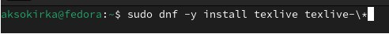{#fig:001 width=70%}

Установление необходимого ПО(рис. [-@fig:002]):

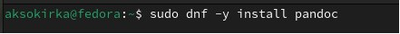{#fig:002 width=70%}

Установление необходимого ПО(рис. [-@fig:003]):

.jpg){#fig:003 width=70%} 

**4.1.1 Установка TexLive**

Скачала TexLive с официального сайта (рис. [-@fig:004]):

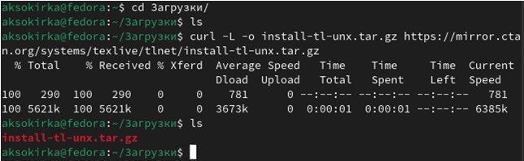{#fig:004 width=70%}

Распаковываю архив. Перехожу в распакованную папку с помощью cd. Запускаю скрипт install-tl-* с правами root, используя sudo в начале команды (рис. [-@fig:005]):

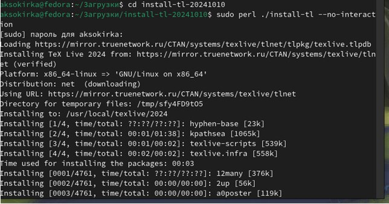{#fig:005 width=70%}

Добавляю /usr/local/texlive/2022/bin/x86_64-linux в свой PATH для текущей и будущих сессий (рис. [-@fig:006]):

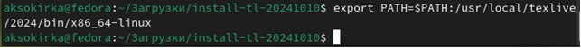{#fig:006 width=70%}

**4.1.2 Установка pandoc и pandoc-crossref**

Скачиваю архив pandoc (рис. [-@fig:007]):

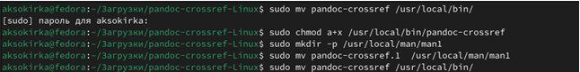{#fig:007 width=70%}

**4.2 Заполнение отчета по выполнению лабораторной работы №3 с помощью языка разметки Markdown**

Открываю терминал. Перехожу в каталог курса, сформированный при выполненнии прошлой лаборатной работы (рис. [-@fig:008]):

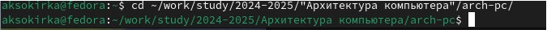{#fig:008 width=70%}

Обновляю локальный репозиторий, скачав изменения из удаленного репозитория с помощью команды git pull (рис. [-@fig:009]):

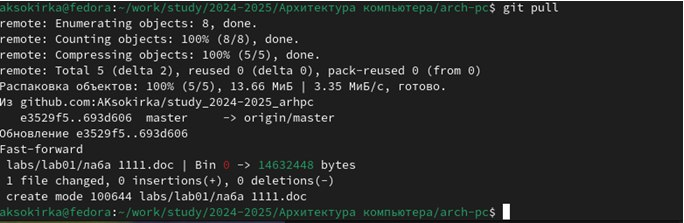{#fig:009 width=70%}

Перехожу в каталог с шаблоном отчета по лабораторной работе №3. Компилирую шаблон с использованием Makefile, вводя команду make (рис. [-@fig:010]):

{#fig:010 width=70%}

Удаляю полученные файлы с использованием Makefile, вводя команду make clean (рис.12). С помощью команды ls проверяю, удалились ли созданные файлы (рис. [-@fig:011]):

.jpg){#fig:011 width=70%}

Скачиваю текстовый редактор mousepad (рис. [-@fig:012]):

.jpg){#fig:012 width=70%}

Открываю файл report.md с помощью текстового редактора mousepad (рис. [-@fig:013]):

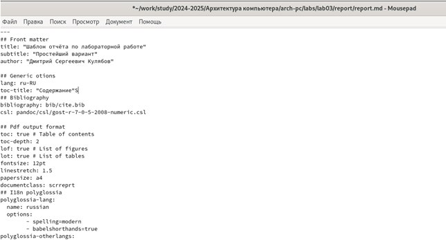{#fig:013 width=70%}

# Задания для самостоятельной работы

Перехожу в директорию lab03/report с помощью cd, чтобы там заполнить отчет по третьей лабораторной работе (рис. [-@fig:014]):

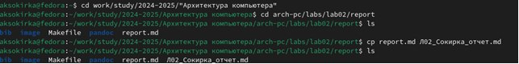{#fig:014 width=70%}

Составляю отчет и загружаю на Github (рис. [-@fig:015]):

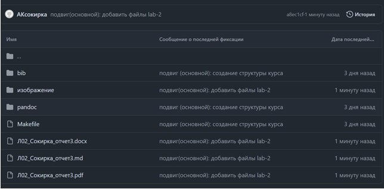{#fig:015 width=70%}

# Выводы

В результате выполнения данной лабораторной работы я освоила процедуры оформления отчетов с помощью легковесного языка разметки Markdown.

# Список литературы

1. Архитектура ЭВМ (https://esystem.rudn.ru/pluginfile.php/1584625/mod_resource/content/1/%D0%9B%D0%B0%D0%B1%D0%BE%D1%80%D0%B0%D1%82%D0%BE%D1%80%D0%BD%D0%B0%D1%8F%20%D1%80%D0%B0%D0%B1%D0%BE%D1%82%D0%B0%20%E2%84%964.pdf)

2. Журнал "Код" (https://thecode.media/markdown/)

