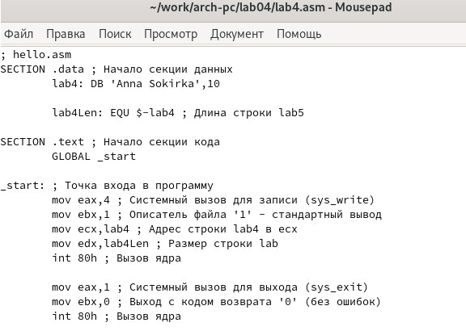

---
## Front matter
title: "Шаблон отчёта по лабораторной работе"
subtitle: "Простейший вариант"
author: "Cокирка Анна Константиновна"

## Generic otions
lang: ru-RU
toc-title: "Содержание"

## Bibliography
bibliography: bib/cite.bib
csl: pandoc/csl/gost-r-7-0-5-2008-numeric.csl

## Pdf output format
toc: true # Table of contents
toc-depth: 2
lof: true # List of figures
lot: true # List of tables
fontsize: 12pt
linestretch: 1.5
papersize: a4
documentclass: scrreprt
## I18n polyglossia
polyglossia-lang:
  name: russian
  options:
	- spelling=modern
	- babelshorthands=true
polyglossia-otherlangs:
  name: english
## I18n babel
babel-lang: russian
babel-otherlangs: english
## Fonts
mainfont: IBM Plex Serif
romanfont: IBM Plex Serif
sansfont: IBM Plex Sans
monofont: IBM Plex Mono
mathfont: STIX Two Math
mainfontoptions: Ligatures=Common,Ligatures=TeX,Scale=0.94
romanfontoptions: Ligatures=Common,Ligatures=TeX,Scale=0.94
sansfontoptions: Ligatures=Common,Ligatures=TeX,Scale=MatchLowercase,Scale=0.94
monofontoptions: Scale=MatchLowercase,Scale=0.94,FakeStretch=0.9
mathfontoptions:
## Biblatex
biblatex: true
biblio-style: "gost-numeric"
biblatexoptions:
  - parentracker=true
  - backend=biber
  - hyperref=auto
  - language=auto
  - autolang=other*
  - citestyle=gost-numeric
## Pandoc-crossref LaTeX customization
figureTitle: "Рис."
tableTitle: "Таблица"
listingTitle: "Листинг"
lofTitle: "Список иллюстраций"
lotTitle: "Список таблиц"
lolTitle: "Листинги"
## Misc options
indent: true
header-includes:
  - \usepackage{indentfirst}
  - \usepackage{float} # keep figures where there are in the text
  - \floatplacement{figure}{H} # keep figures where there are in the text
---
# Содержание 
1. Цель работы
2. Задание
3. Теоретическое введение
4. Выполнение лабораторной работы  
4.1. Программа Hello world!  
4.2. Транслятор NASM   
4.3. Расширенный синтаксис командной строки NASM  
4.4. Компоновщик LD  
4.5. Запуск исполняемого файла
5. Задание для самостоятельной работы
6. Выводы
7. Список литературы

# Цель работы

Освоение процедуры компиляции и сборки программ, написанных на ассемблере NASM.

# Задание

4.1. Программа Hello world!  
4.2. Транслятор NASM  
4.3. Расширенный синтаксис командной строки NASM  
4.4. Компоновщик LD  
4.5. Запуск исполняемого файла  

# Теоретическое введение
Основными функциональными элементами любой электронно-вычислительной машины (ЭВМ) являются центральный процессор, память и периферийные устройства. Взаимодействие этих устройств осуществляется через общую шину, к которой они подключены. Физически шина представляет собой большое количество проводников, соединяющих устройства друг с другом. В современных компьютерах проводники выполнены в виде электропроводящих дорожек на материнской (системной) плате. Основной задачей процессора является обработка информации, а также организация координации всех узлов компьютера. В состав центрального процессора (ЦП) входят следующие устройства: • арифметико-логическое устройство (АЛУ) — выполняет логические и арифметические действия, необходимые для обработки информации, хранящейся в памяти; • устройство управления (УУ) — обеспечивает управление и контроль всех устройств компьютера; • регистры — сверхбыстрая оперативная память небольшого объёма, входящая в состав процессора, для временного хранения промежуточных результатов выполнения инструкций; регистры процессора делятся на два типа: регистры общего назначения и специальные регистры. Для того, чтобы писать программы на ассемблере, необходимо знать, какие регистры процессора существуют и как их можно использовать. Большинство команд в программах написанных на ассемблере используют регистры в качестве операндов. Практически все команды представляют собой преобразование данных хранящихся в регистрах процессора, это например пересылка данных между регистрами или между регистрами и памятью, преобразование (арифметические или логические операции) данных хранящихся в регистрах.
Доступ к регистрам осуществляется не по адресам, как к основной памяти, а по именам. Каждый регистр процессора архитектуры x86 имеет свое название, состоящее из 2 или 3 букв латинского алфавита. В качестве примера приведем названия основных регистров общего назначения (именно эти регистры чаще всего используются при написании программ): • RAX, RCX, RDX, RBX, RSI, RDI — 64-битные • EAX, ECX, EDX, EBX, ESI, EDI — 32-битные • AX, CX, DX, BX, SI, DI — 16-битные • AH, AL, CH, CL, DH, DL, BH, BL — 8-битные (половинки 16-битных регистров). Например, AH (high AX) — старшие 8 бит регистра AX, AL (low AX) — младшие 8 бит регистра AX.
В основе вычислительного процесса ЭВМ лежит принцип программного управления. Это означает, что компьютер решает поставленную задачу как последовательность действий, записанных в виде программы. Программа состоит из машинных команд, которые указывают, какие операции и над какими данными (или операндами), в какой последовательности необходимо выполнить. Набор машинных команд определяется устройством конкретного процессора. Коды команд представляют собой многоразрядные двоичные комбинации из 0 и 1. В коде машинной команды можно выделить две части: операционную и адресную. В операционной части хранится код команды, которую необходимо выполнить. В адресной части хранятся данные или адреса данных, которые участвуют в выполнении данной операции. При выполнении каждой команды процессор выполняет определённую последовательность стандартных действий, которая называется командным циклом процессора. В самом общем виде он заключается в следующем: 1. формирование адреса в памяти очередной команды; 2. считывание кода команды из памяти и её дешифрация; 3. выполнение команды; 4. переход к следующей команде.
В процессе создания ассемблерной программы можно выделить четыре шага: • Набор текста программы в текстовом редакторе и сохранение её в отдельном файле. Каждый файл имеет свой тип (или расширение), который определяет назначение файла. Файлы с исходным текстом программ на языке ассемблера имеют тип asm. • Трансляция — преобразование с помощью транслятора, например nasm, текста программы в машинный код, называемый объектным. На данном этапе также может быть получен листинг программы, содержащий кроме текста программы различную дополнительную информацию, созданную транслятором. Тип объектного файла — o, файла листинга — lst. • Компоновка или линковка — этап обработки объектного кода компоновщиком (ld), который принимает на вход объектные файлы и собирает по ним исполняемый файл. Исполняемый файл обычно не имеет расширения. Кроме того, можно получить файл карты загрузки программы в ОЗУ, имеющий расширение map. • Запуск программы. Конечной целью является работоспособный исполняемый файл. Ошибки на предыдущих этапах могут привести к некорректной работе программы, поэтому может присутствовать этап отладки программы при помощи специальной программы — отладчика. При нахождении ошибки необходимо провести коррекцию программы, начиная с первого шага. Из-за специфики программирования, а также по традиции для создания программ на языке ассемблера обычно пользуются утилитами командной строки (хотя поддержка ассемблера есть в некоторых универсальных интегрированных средах).

# Выполнение лабораторной работы

**4 Выполнение лабораторной работы**

4.1. Программа Hello world! 

Создам каталог для работы с программами на языке ассемблера NASM. Затем перейду в созданный каталог (рис. [-@fig:001]).

{#fig:001 width=70%}

Создам текстовый файл с именем hello.asm (рис. [-@fig:002]).

{#fig:002 width=70%}

Открою этот файл с помощью любого текстового редактора, например, mousepad(рис. [-@fig:003]).

{#fig:003 width=70%}

Заполняю файл, вставляя в него программу для вывода “Hello word!” (рис. [-@fig:004]).

{#fig:004 width=70%}

**4.2 Работа с транслятором NASM**

Превращаю текст программы в объектный код. Далее проверяю правильность выполнения команды с помощью утилиты ls рис. [-@fig:005]).

{#fig:005 width=70%}

**4.3 Работа с расширенным синтаксисом командной строки NASM**

Ввожу команду, которая скомпилирует исходный файл hello.asm в obj.o (опция -o позволяет задать имя объектного файла, в данном случае obj.o), при этом формат выходного файла будет elf, и в него будут включены символы для отладки (опция -g), кроме того, будет создан файл листинга list.lst (опция -l). С помощью команды ls проверю, что файлы были созданы (рис. [-@fig:006]).

{#fig:006 width=70%}

**4.4 Работа с компоновщиком LD**

Передаю объектный файл hello.o на обработку компоновщику LD, чтобы получить исполняемый файл hello. Ключ -о задает имя создаваемого исполняемого файла. Далее проверяю с помощью утилиты ls правильность выполнения команды. (рис. [-@fig:007]).

{#fig:007 width=70%}

**4.5 Запуск исполняемого файла**

Запускаю на выполнение созданный исполняемый файл hello (рис. [-@fig:008]).

{#fig:008 width=70%}

**5. Задание для самостоятельной работы**

С помощью текстового редактора mousepad открываю файл lab4.asm и вношу изменения в программу так, чтобы она выводила мои имя и фамилию (рис. [-@fig:009]).

{#fig:009 width=70%}

Компилирую текст программы в объектный файл. Проверяю с помощью утилиты ls, что файл lab5.o создан (рис. [-@fig:010]).

{#fig:010 width=70%}

Передаю объектный файл lab4.o на обработку компоновщику LD, чтобы получить исполняемый файл lab4 (рис. [-@fig:011]).

{#fig:011 width=70%}

Запускаю исполняемый файл lab4, на экран действительно выводятся мои имя и фамилия (рис. [-@fig:012]).

{#fig:012 width=70%}

Скопирую файлы в мой локальный репозиторий в каталог ~/work/study/2024-2025/"Архитектура компьютера"/arch-pc/labs/lab04 (рис. [-@fig:013]).

{#fig:013 width=70%}

Отправляю файлы на github (рис. [-@fig:014]).

{#fig:014 width=70%}

# Выводы

При выполнении данной лабораторной работы я освоила процедуры компиляции и сборки программ, написанных на ассемблере NASM.

# Список литературы

 1.https://esystem.rudn.ru/pluginfile.php/2089084/mod_resource/content/0/Лабораторная%20работа%20№4.%20Создание%20и%20процесс%20обработки%20программ%20на%20языке%20ассемблера%20NASM.pdf
